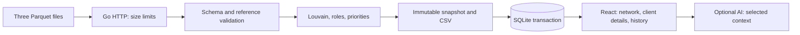

# AMLens architecture

## Data flow

Go is organized as a modular monolith. Domain owns values, analytical rules and explanations; application owns use cases and interfaces; infrastructure provides Parquet, graph, SQLite, CSV and AI adapters; the HTTP layer handles the protocol. Roles, clustering and priorities do not depend on an LLM.

Imports run synchronously. Temporary inputs are deleted after processing. During a new calculation, GET requests see the previous snapshot. A semaphore serializes import and history activation. A new snapshot is published in memory only after the database transaction commits. Validation or storage failures preserve the previous result. The active version is restored before the HTTP port is opened.

SQLite stores immutable snapshots with internal explanation fields and three exports. Gob preserves int64 and decimal values; HTTP JSON uses strings for identifiers. `user_version=1` identifies the storage format; unknown versions prevent startup. History returns the latest 100 entries without automatically deleting older records.

## Graph

The global view includes all nodes and directed edges, disconnected components and isolated nodes. The local view limits only the selected client's neighborhood. Large layouts run in a Web Worker using Barnes–Hut repulsion and stop after settling. Rendering uses WebGL 2 with Canvas fallback. Labels are bounded; full identifiers remain available on selection and hover.

Admission limits are not browser rendering performance guarantees. Network density, graphics hardware and memory affect responsiveness. Layout benchmarks in Node do not measure browser FPS.

## Localization

English is the default, with Russian and Kazakh available from the header. The chosen language is stored in browser local storage; unavailable storage leaves the session usable. React subscribers update labels without remounting the application. Dates and numbers use the selected locale, while currency remains KZT.

The API negotiates `en`, `ru` and `kk` through `Accept-Language`, including regional tags and quality weights, and returns `Content-Language`. Only narrative fields are translated at the presentation boundary. JSON numbers, string identifiers, technical codes and saved snapshots remain unchanged. Existing Russian source explanations are supported without database migration. CSV headers and machine-readable fields remain stable; narrative columns are localized when downloaded.

The frontend refreshes analysis explanations when the language changes. The assistant receives the selected response language as a server instruction. Changing language clears an existing assistant answer and cancels waiting for an in-flight response; it does not issue another AI request.

## Deployment

Caddy serves the static React bundle and proxies `/api` to Go. The API has no separate published host port. Both containers run without root, with read-only root filesystems, temporary directories and health checks. SQLite lives in a persistent volume. Shutdown allows active HTTP requests up to ten seconds to finish.

Regular mode supports one shared workspace and one API process, locally or behind a VPN. There are no accounts, permissions, personal workspaces or organization isolation. Multiple API processes sharing SQLite are unsupported. Extending to that model requires analysis ownership, authorization, background jobs and coordination of the active version.

The public mode is a synthetic demo with its own volume and database mode marker, server-enforced read-only behavior and disabled AI. The Go Parquet generator does not read hackathon materials.

## Analytical limitations

Roles and priorities are explainable heuristics. They do not prove wrongdoing or express a probability of guilt. Bank coverage and balances are unknown; `depth=4` marks an observation boundary. Edge amounts and `n_tx` are not automatically reconciled against transactions. Snapshots contain derived financial data and are excluded from Git just like source files.

AI context is limited to selected nodes and nearby connections. The complete dataset and raw transactions are not sent. Validating references does not prove the generated text is accurate. API keys are stored only on the server.
