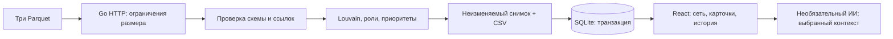

# Архитектура AMLens

## Путь данных

Go — модульный монолит. Domain отвечает за значения, правила и объяснения; application — за сценарии и интерфейсы; infrastructure — за Parquet, граф, SQLite, CSV и ИИ; HTTP-слой — за протокол. Расчёт ролей, кластеров и приоритетов не зависит от LLM.

Импорт выполняется синхронно. Временные входы удаляются после обработки. Пока идёт новый расчёт, GET видит предыдущий снимок. Один семафор сериализует импорт и выбор исторической версии. Новый снимок публикуется в памяти только после успешного commit базы. Ошибка данных или записи сохраняет прошлый результат. Активная версия восстанавливается до открытия HTTP-порта.

SQLite хранит неизменяемые снимки с внутренними полями объяснений и тремя экспортами. Gob сохраняет int64 и decimal; публичный JSON передаёт идентификаторы строками. user_version=1 фиксирует формат, неизвестная версия останавливает запуск. История возвращает последние 100 записей; хранилище не очищается автоматически.

## Граф

Общий вид показывает все узлы и направленные связи, включая отдельные компоненты и изолированные узлы. Локальный вид ограничивает только окружение выбранного клиента. Раскладка больших сетей работает в Web Worker, использует Barnes–Hut и засыпает после стабилизации. Рендеринг — WebGL 2 с Canvas как резервным вариантом. Число подписей ограничено; полный идентификатор доступен при выборе и наведении.

Максимальные входные лимиты не равны комфортному объёму графа в браузере. Плотность сети, видеокарта и память влияют на скорость. Измерения физики в Node не являются измерениями FPS браузера.

## Размещение

Caddy отдаёт статическую сборку React и проксирует /api в Go. API не публикует отдельный порт хоста. Оба контейнера работают без root, с read-only корневой системой, отдельными временными каталогами и health checks. SQLite расположен в постоянном томе. Остановка API корректно завершает активные HTTP-запросы в пределах 10 секунд.

Обычный режим — одно общее рабочее пространство, один процесс API, локально либо за VPN. Нет аккаунтов, прав доступа, персональных кабинетов и изоляции организаций. Запуск нескольких API с общей SQLite не поддерживается. Для такого расширения потребуются отдельные владельцы анализов, авторизация, фоновые задачи и согласование активной версии.

Публичный режим предназначен для синтетического демо: отдельные том и отметка режима в базе, запрет записи на сервере, ИИ выключен. Генератор исходных Parquet написан в Go и не читает материалы хакатона.

## Ограничения выводов

Роли и приоритеты — объяснимые эвристики. Они не доказывают нарушение и не являются вероятностью виновности. Полнота банковского охвата и балансы неизвестны; depth=4 обозначает границу наблюдения. Суммы и n_tx в edges автоматически не сверяются с transactions. Снимки содержат производные финансовые данные, поэтому исключены из Git так же, как входные файлы.

Контекст ИИ ограничен выбранными узлами и ближайшими связями. Полный набор и сырые операции не отправляются. Проверка ссылок в ответе не гарантирует достоверность текста. Ключ хранится только на сервере.
